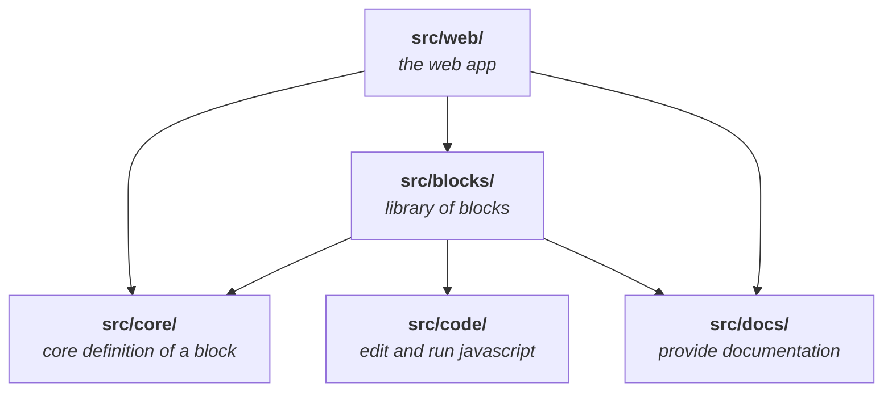

[Try it](https://tbls.dev/)

A notes-spreadsheet-hybrid for programmers. Write notes, store data and process
it. Harness the power of JavaScript, React and their ecosystems with the ease of
use of a spreadsheet. Even extending ReSheet with your custom Blocks (the
equivalent of cells in a spreadsheet) for your use-case is possible.

## Discord

For Questions, Feedback, or showing what you did in ReSheet (I'm always
interested, please share!) join the ReSheet Discord Server:

[Join ReSheet on Discord](https://discord.gg/TQePmKJNQP)

## Roadmap

### Improvements

- [ ] React interop: External libs depending on react may break
- [ ] Inspector: Improve perfomance and design; make it customizable
- [ ] Performance: Don't block UI by computations

### Features

- [ ] Simple Block: Easily turn React code into a Block
- [ ] ListOf/RecordOf Block: Blocks explicitly for lists and tables

## Sustainability

In the last months I have put all my available time into developing ReSheet. I'd
love for it to become a stable and mature tool for developers seeking a powerful
spreadsheet, that gives them the power of a popular programming language with
its vast ecosystem and the UX of a spreadsheet. Therefore everything I develop
is going to be open source.

My favourite option to continue developing this is (unsurprisingly) to make it
into my full-time job. For that I thought about developing some extra (premium)
Blocks, that don't get bundled with ReSheet. They should still be open source and
on GitHub, but not openly packaged anywhere (npm). If you'd like to support the
development of ReSheet, you can then pay to get access to the packaged Blocks
hosted by me. I hope this sounds fair.

## Background

This is still a prototype. The code is neither documented nor has it many tests.
This made it easier for me to experiment with different ideas and discard them.
Despite efforts to make it stable, it can crash because of errors in the code a
user writes in it. Also, I'm sure ReSheet itself still has enough bugs. ;)

One of my goals was to keep the codebase as simple while still as versatile and
powerful as possible. I'm currently very pleased with the state in this regard.
In `src/index.tsx` you can see the hard-coded root "Block", which can be thought
of as a cell in Excel or a line/page/database in Notion.

## Development

Running ReSheet locally should be easy. Make sure you have a `node` environment and
`yarn` (classic/v1) installed. Then:

    $ yarn
      ... installs dependencies ...

    $ yarn start
      ... starts development server (parcel) ...

and ReSheet should be up and running on http://localhost:1234/.

## Architecture

### `core`

At the core of ReSheet lies the concept of a Block. A Block is the equivalent to
a cell in a spreadsheet. In `core` lies the definition of the Block interface
and some helper functions specific for Blocks.

### `blocks`

In `blocks` lie all Block implementations. Among them:
- `JSExpr`: A multiline JavaScript Block
- `block-selector`: Dynamically select any available Block (using JavaScript)
- `sheet`: A sheet of Blocks. Consists of lines, that can be named and can
  reference prior lines.
- `note`: A versatile Block to just write some text with markdown, embed a
  JavaScript expression or embed another Block.
- `document`: A wrapper that implements application-level functionality:
  Saving/Loading, History, Hierarchy of Pages, Shortcut Suggestions, Command
  Search.

### `web`

`web` properly bundles everything as a web app. It implements automatic saving
of backups in IndexedDB and a few other top-level UI elements like the toasts on
the top right and the focus indicator.

### `code`

`code` contains code-editing/-running functionality.

The editing core: `useEditable`, a hook for implementing editors with
content-editable. On top of that lies `editor`, which implements an editor
component with code highlighting.

The running core: `compute`, implementing transpiling (React) code and running it.

`completions` is another honorable mention, it implements code completions (as
the name suggests).

### `docs`

`docs` contains the documentation infrastructure. It contains external
documentation resources, currently only a specific extract of MDN. `blocks`
provides further documentation for Blocks using `docs`.