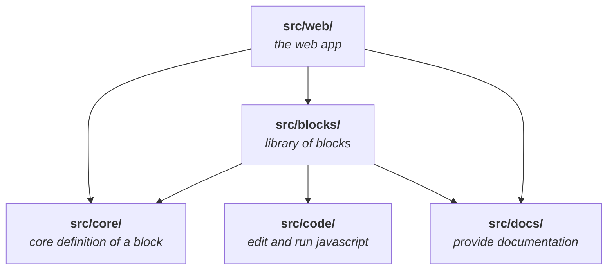

<h1>
  
  ReSheet
  beta
</h1>

[Try it](https://resheet.dev/)

A notes-spreadsheet-hybrid for programmers. Write notes, store data and process
it. Harness the power of JavaScript, React and their ecosystems with the ease of
use of a spreadsheet. Even extending ReSheet with your custom Blocks (the
equivalent of cells in a spreadsheet) for your use-case is possible.

## Discord

For Questions, Feedback, or showing what you did in ReSheet (I'm always
interested, please share!) join the ReSheet Discord Server:

[Join ReSheet on Discord](https://discord.gg/TQePmKJNQP)

## Roadmap

ReSheet is currently in beta stage. This means it may be missing important
features and may have some bugs. There are no bigger changes coming and it is
already productively usable.

After these issues are adressed, ReSheet will be ready for the first stable
release.

## Development

Running ReSheet locally should be easy. Make sure you have a `node` environment and
`yarn` (classic/v1) installed. Then:

    $ yarn
      ... installs dependencies ...

    $ yarn start
      ... starts development server (parcel) ...

and ReSheet should be up and running on http://localhost:1234/.

## Architecture

One of my goals was to keep the codebase as simple while still as versatile and
powerful as possible. I'm currently very pleased with the state in this regard.
ReSheet revolves around the definition of a Block, something similar to a cell
in a spreadsheet. In `src/core/block.tsx` you can see its interface definition.
In `src/web/index.tsx` you can see the hard-coded top-level Block for the web
app. I tried to write ReSheet in a way, that it can be used as a toolbox for
building similar tools by combining and writing custom Blocks.

Unfortunately the code itself is still 99.9% undocumented. (This codebase
evolved from a prototype.)

### `core`

At the core of ReSheet lies the concept of a Block. A Block is the equivalent to
a cell in a spreadsheet. In `core` lies the definition of the Block interface
and some helper functions specific for Blocks.

### `blocks`

In `blocks` lie all Block implementations. Among them:
- `JSExpr`: A multiline JavaScript Block
- `block-selector`: Dynamically select any available Block (using JavaScript)
- `sheet`: A sheet of Blocks. Consists of lines that can be named and can
  reference prior lines.
- `note`: A versatile Block to just write some text with markdown, embed a
  JavaScript expression or embed another Block.
- `document`: A wrapper that implements application-level functionality:
  Saving/Loading, History, Hierarchy of Pages, Shortcut Suggestions, Command
  Search.

### `web`

`web` properly bundles everything as a web app. It implements automatic saving
of backups in IndexedDB and a few other top-level UI elements like the toasts on
the top right and the focus indicator.

### `code`

`code` contains code-editing/-running functionality.

The editing core: `useEditable`, a hook for implementing editors with
content-editable. On top of that lies `editor`, which implements an editor
component with code highlighting.

The running core: `compute`, implementing transpiling (React) code and running it.

`completions` is another honorable mention, it implements code completions (as
the name suggests).

### `docs`

`docs` contains the documentation infrastructure. It contains external
documentation resources, currently only a specific extract of MDN. `blocks`
provides further documentation for Blocks using `docs`.